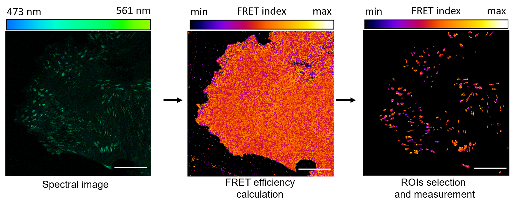

# ImageJ_Macros
This set of macros has been developed to perform different tasks in the analysis of confocal and spectral images of epithelial adhesion complexes. The macros allow to quickly segment regions of interest, calculate FRET and perform multiple intensity measurements.
## Segmentation, FRET calculation and FRET measurement macro
The "MacroSet_Segmentation_PixFRET_Measure.ijm.ijm" file is a Macro Set that can perform **segmentation**, **calculate FRET** using the PixFRET plugin, and **measure the FRET Index** of the Regions Of Interest (ROIs) generated by segmentation on a folder of images or on single images. 
Currently the macro works for .lsm and .czi formats

It is specifically designed for the segmentation of Focal Adhesion but feel free to change it to suit your needs.
The macro works on spectral images, specifically with donor emission on channel 3 and acceptor emission in channel 7. If you wish measure the FRET using different channel please takes this into account.

**TO USE**: 
1. Open ImageJ > Plugins > Macros > Install... 
2. Click on the Macros in Plugins > Macros 

**Segmentation** performs a basic segmentation (with a bit of help from the user) and creates a folder called "ROI Sets" in the same folder that is analysed or in the folder containing the image in case of single image analysis.
Remember to check the scale (micrometers to pixels) and correct the macro if different from the script.
Also, calibrate the Analyze Particles values to what best suits your needs. E.g. if working on FAs, analyse small and elongated particles but avoid very small and very circular particles. 
If working on nuclei, aim for big and round particles!

The macro works by:
1. selecting the acceptor channel from the spectral image (it is one of the channel with the best intensity/noise ratio)
2. filter the image to remove noise and smoothen the signal
3. threshold the image to create a mask (the level of thresholding is decided by the user)
4. Analyze the particles created by the mask to select the one with the desired shape ans size 
5. Save the resulting ROIs

**"Quick PixFRET"** executes the PixFRET plugin, free of human interaction!
Before using this macro you need to install Autoclicker, and set the mouse coordinates to those specific to your screen.
*This mcro section will be updated to allow FRET calculation without any plugin.*

**"Measure FRET"** simply opens the FRET Efficiency image(s) created by Quick PixFRET and the ROI file created by Segmentation
It sets every pixel outside te ROIs to NaN (NotAValue), and then measures the area, mean value and standard deviation of each ROI.
Later, it saves the measurements in a newly created "Results" folder. The measurement paramenters can be adjusted to your needs.

